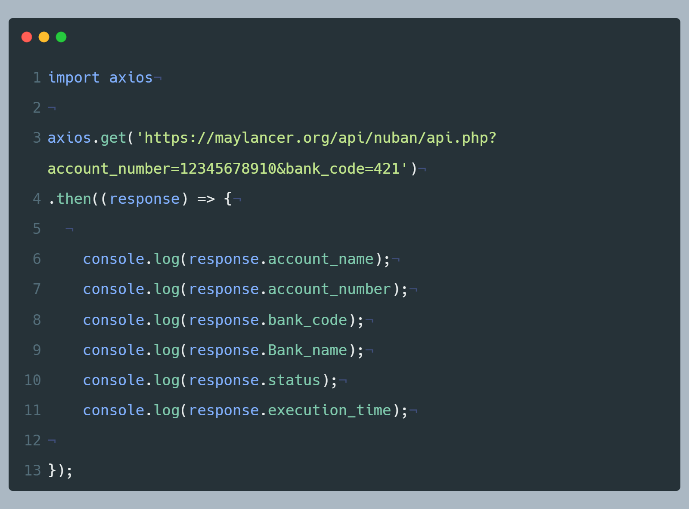

# Real-time Nigeria Bank Account validation API.

You can lookup any bank account details in Nigeria using our free bank API in few seconds to build applications faster.

::: tip
:bell: Our API is higly secure and our system do not store any bank record
:::

Most times you want to find the name of the person that owns a particular account automatically for verification mechanism. Instead of logging to you internet banking and start the transfer to confirm. 

You can use this simple tool to do the heavy lifting. All you have to do is allow user to sellect the bank and enter the account number. Our system will extract the information attached to that account.

**Built by Developer, for Developer**